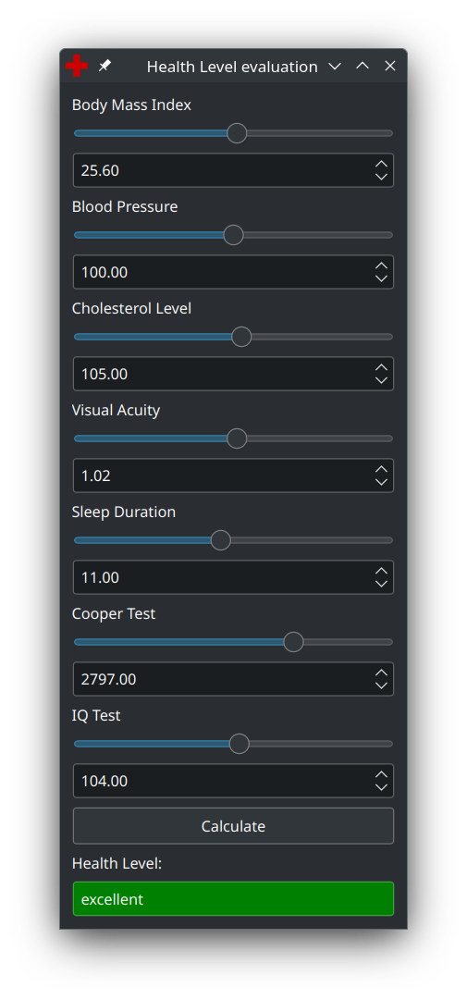

# Проектування інтелектуальних інтерфейсів
## Лабораторна робота №01

Тема: Нечіткий інтелектуальний інтерфейс діагностики здоров'я людини

Виконав: Волошин Віталій Анатолійович, ІПЗм-21

Презентація: [task_01.pptx](task_01.pptx)  

Тестові дані: [data.csv](data.csv)

